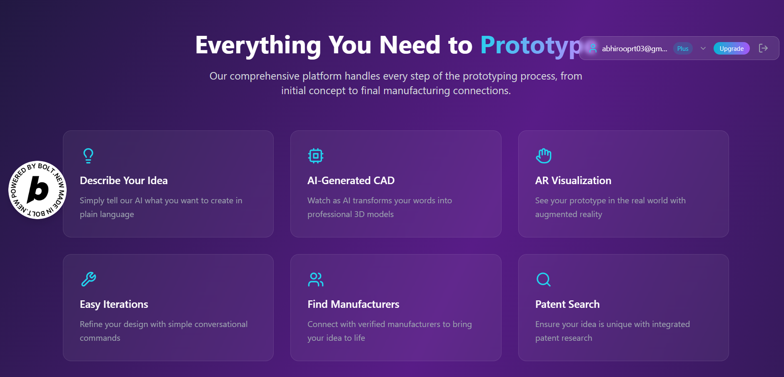

# 🎨 AgentiCAD

**Professional AI-Powered CAD Design Platform**

Transform your ideas into professional 3D CAD models using advanced AI and multimodal input processing. AgentiCAD combines the power of modern AI with professional CAD design tools to make 3D modeling accessible to everyone.



## ✨ Features

### 🤖 **AI-Powered CAD Generation**
- **Text-to-CAD**: Describe your idea and get professional 3D models
- **Voice Input**: Speak your design concepts naturally
- **Sketch-to-CAD**: Upload sketches and convert them to 3D models
- **Image-to-CAD**: Transform photos into CAD designs

### 🛠️ **Professional Tools**
- **Real-time 3D Viewer**: Interactive 360° model visualization
- **Multi-format Export**: STL, OBJ, PLY, GLTF support
- **Component Analysis**: AI-powered material and specification detection
- **Editable Specifications**: Modify materials, dimensions, and properties

### 🔧 **Advanced Capabilities**
- **AR Visualization**: View models in augmented reality
- **Manufacturing Integration**: Cost estimation and material optimization
- **Subscription Management**: Tiered access with Stripe integration
- **Component Detection**: Automatic identification of separate parts

### 🎯 **User Experience**
- **Multimodal Input**: Text, voice, sketches, and photos
- **Progress Tracking**: Real-time generation status
- **Professional UI**: Modern, responsive design
- **Cross-platform**: Works on desktop and mobile

## 🚀 Quick Start

1. **Clone the repository**
   ```bash
   git clone https://github.com/yourusername/agenticad.git
   cd agenticad
   ```

2. **Install dependencies**
   ```bash
   npm install
   ```

3. **Setup environment**
   ```bash
   cp env.example.txt .env
   # Edit .env with your API keys (see SETUP.md for details)
   ```

4. **Start development server**
   ```bash
   npm run dev
   ```

5. **Open in browser**
   ```
   http://localhost:5173
   ```

## 📚 Documentation

- **[Setup Guide](SETUP.md)** - Complete installation and configuration
- **[API Documentation](README_API_SETUP.md)** - Backend API reference
- **[Zoo Integration](README_ZOO_INTEGRATION.md)** - CAD generation service
- **[Architecture Guide](ARCHITECTURAL_SYSTEM_GUIDE.md)** - System design overview

## 🏗️ Tech Stack

### Frontend
- **React 18** + **TypeScript** + **Vite**
- **Tailwind CSS** for styling
- **Three.js** for 3D visualization
- **React Query** for state management

### Backend
- **Supabase** (PostgreSQL + Auth + Edge Functions)
- **Stripe** for payment processing
- **Deno** for serverless functions

### AI Services
- **Zoo.dev** for CAD generation
- **Pica AI** for multimodal processing
- **Gemini Flash** for component analysis

### 3D & Graphics
- **WebGL** + **Three.js** for rendering
- **WebXR** for AR capabilities
- **GLB/GLTF** for 3D model format

## 🛡️ Security & Privacy

- ✅ **Environment-based configuration** - No hardcoded secrets
- ✅ **Secure authentication** - Supabase Auth with JWT
- ✅ **Payment security** - PCI-compliant Stripe integration
- ✅ **API key protection** - Proper environment variable usage
- ✅ **CORS protection** - Configured for production security

## 🔄 Development Workflow

### Branch Strategy
```bash
main          # Production-ready code
develop       # Integration branch
feature/*     # Feature development
hotfix/*      # Critical fixes
```

### Code Standards
- **TypeScript** for type safety
- **ESLint** + **Prettier** for code formatting
- **Conventional Commits** for commit messages
- **Component-based architecture**

### Testing
```bash
npm run test        # Run tests
npm run test:watch  # Watch mode
npm run test:ci     # CI mode
```

## 🚀 Deployment

### Environment Setup
1. Configure environment variables in your hosting platform
2. Set up Supabase project and deploy Edge Functions
3. Configure Stripe webhooks
4. Deploy frontend to your preferred platform

### Supported Platforms
- **Vercel** (recommended for frontend)
- **Netlify**
- **AWS Amplify**
- **Docker** (containerized deployment)

## 🤝 Contributing

We welcome contributions! Please follow these steps:

1. **Fork the repository**
2. **Create feature branch**: `git checkout -b feature/amazing-feature`
3. **Make your changes** with proper TypeScript types
4. **Add tests** for new functionality
5. **Commit changes**: `git commit -m 'feat: add amazing feature'`
6. **Push to branch**: `git push origin feature/amazing-feature`
7. **Open Pull Request**

### Contribution Guidelines
- Follow existing code style and patterns
- Add tests for new features
- Update documentation as needed
- Use conventional commit messages
- Ensure TypeScript compliance

## 📊 Project Stats

- **Language**: TypeScript/JavaScript
- **Framework**: React + Vite
- **Database**: PostgreSQL (Supabase)
- **Authentication**: Supabase Auth
- **Payments**: Stripe
- **3D Rendering**: Three.js + WebGL
- **AI Services**: Multiple providers

## 🐛 Issue Reporting

Found a bug? Please create an issue with:

- **Clear description** of the problem
- **Steps to reproduce** the issue
- **Expected behavior** vs actual behavior
- **Environment details** (OS, browser, Node version)
- **Screenshots** if applicable

**Note**: Never include API keys or sensitive information in issues!

## 📝 License

This project is licensed under the MIT License - see the [LICENSE](LICENSE) file for details.

## 🙏 Acknowledgments

- **Zoo.dev** for CAD generation API
- **Supabase** for backend infrastructure
- **Three.js** community for 3D rendering capabilities
- **React** ecosystem for frontend framework

## 📞 Support

- **GitHub Issues**: For bug reports and feature requests
- **Documentation**: Check our comprehensive guides
- **Community**: Join discussions in GitHub Discussions

---

**Made with ❤️ by the AgentiCAD Team**

Transform your ideas into reality with AI-powered CAD design. 